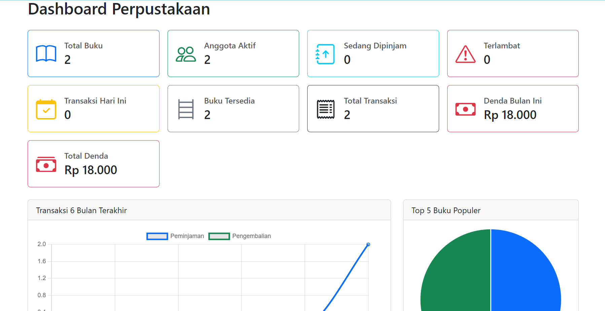
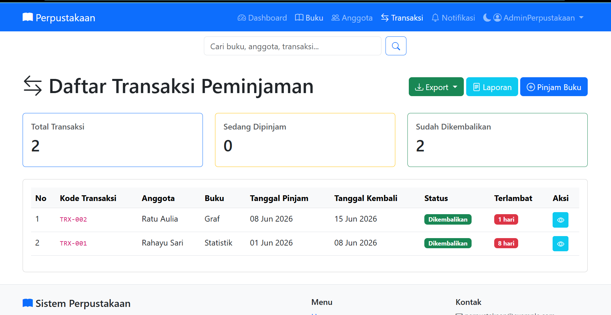
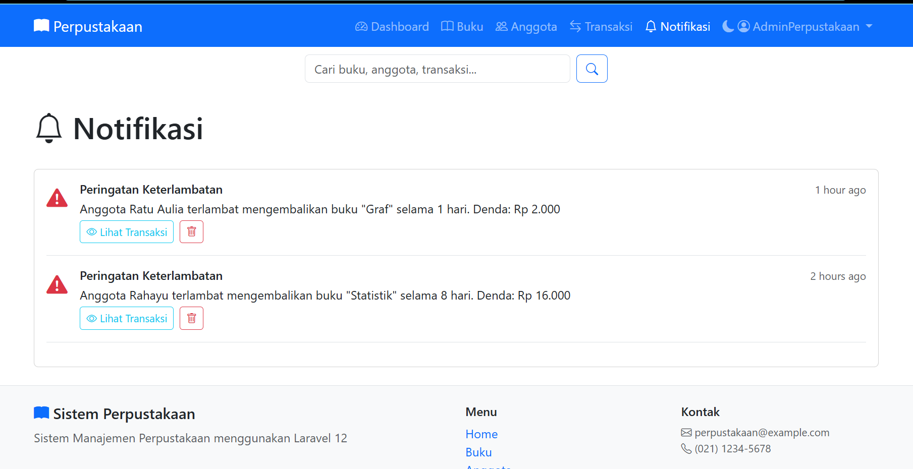
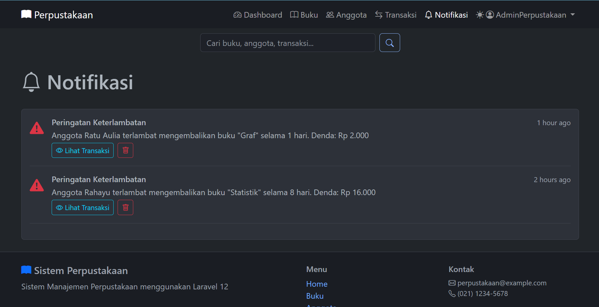
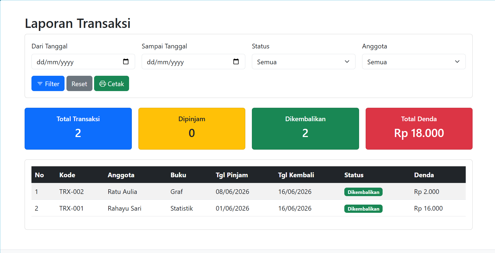

# 📚 Sistem Perpustakaan

Sistem manajemen perpustakaan berbasis web yang dibangun dengan **Laravel 9** dan **Bootstrap 5.3**. Mencakup manajemen buku, anggota, transaksi peminjaman/pengembalian, notifikasi keterlambatan, laporan, ekspor data, hingga integrasi QR Code dan dark mode.

---

## ✨ Fitur Lengkap

### 🔐 Autentikasi & Profil
- [x] Registrasi & Login pengguna
- [x] Reset password via email
- [x] Verifikasi email
- [x] Edit profil pengguna

### 📖 Manajemen Buku
- [x] CRUD buku (tambah, lihat, edit, hapus)
- [x] Kategori buku (Programming, Database, Web Design, Networking, Data Science)
- [x] Tracking stok & ketersediaan
- [x] Ekspor data buku ke Excel

### 👥 Manajemen Anggota
- [x] CRUD anggota
- [x] Status anggota (Aktif / Nonaktif)
- [x] Perhitungan umur & lama keanggotaan
- [x] QR Code anggota (kode anggota sebagai QR)
- [x] Ekspor data anggota ke Excel

### 🔄 Transaksi Peminjaman & Pengembalian
- [x] Peminjaman buku dengan validasi stok
- [x] Maksimal 3 peminjaman aktif per anggota
- [x] Cegah peminjaman ganda buku yang sama
- [x] Cek tunggakan sebelum peminjaman baru
- [x] Pengembalian dengan hitung denda otomatis
- [x] Ekspor transaksi ke PDF & CSV

### 🔔 Notifikasi
- [x] Notifikasi keterlambatan pengembalian
- [x] Polling notifikasi real-time (30 detik)
- [x] Tandai dibaca / semua dibaca
- [x] Hapus notifikasi

### 📊 Laporan & Pencarian
- [x] Laporan transaksi
- [x] Pencarian global (buku & anggota)

### 🎨 Tampilan
- [x] Dark mode (toggle di navbar)
- [x] Responsive design (table-responsive, mobile-friendly)
- [x] SweetAlert2 untuk flash messages
- [x] Bootstrap 5.3 + Tailwind CSS (Breeze)

---

## 📸 Screenshot

### 1. Dashboard


### 2. Daftar Buku


### 3. Daftar Anggota


### 4. Transaksi Peminjaman


### 5. Notifikasi Terlambat


### 6. Dark Mode


### 7. Laporan Transaksi


---

## ⚙️ Teknologi

| Bagian | Teknologi |
|--------|-----------|
| **Backend** | PHP 8.3, Laravel 9 |
| **Frontend** | Bootstrap 5.3, Tailwind CSS 3, Alpine.js |
| **Database** | MySQL |
| **Build Tool** | Laravel Mix 6 |
| **QR Code** | simplesoftwareio/simple-qrcode 4.2 |
| **PDF** | barryvdh/laravel-dompdf |
| **Excel** | maatwebsite/excel |
| **Auth** | Laravel Breeze |
| **Notifikasi** | Database polling (AJAX 30s) |

---

## 🚀 Instalasi

### Prasyarat
- PHP ^8.0
- Composer
- MySQL / MariaDB
- Node.js & NPM

### Langkah-langkah

```bash
# 1. Clone repositori
git clone https://github.com/ahabbany/Pertemuan-15.git
cd perpustakaan

# 2. Install dependency PHP
composer install

# 3. Salin file environment
copy .env.example .env

# 4. Generate key aplikasi
php artisan key:generate

# 5. Konfigurasi database di .env
#    DB_CONNECTION=mysql
#    DB_HOST=127.0.0.1
#    DB_PORT=3306
#    DB_DATABASE=perpustakaan_laravel
#    DB_USERNAME=root
#    DB_PASSWORD=

# 6. Buat database (sesuaikan nama di .env)
mysql -u root -p -e "CREATE DATABASE perpustakaan_laravel"

# 7. Jalankan migrasi & seeder
php artisan migrate --seed

# 8. Install & build frontend
npm install
npm run production

# 9. Buat storage link
php artisan storage:link

# 10. Jalankan server
php artisan serve
```

Buka `http://localhost:8000` di browser.

> **Login default (seeder):**  
> Register akun baru melalui halaman `/register`, atau buat manual via database.

---

## 👤 Author

**Aghitsna Yashiva A. A.**  
NIM: 60324090  
UIN K. H. Abdurrahman Wahid - Tugas Akhir Sistem Perpustakaan Pemograman Web 2
