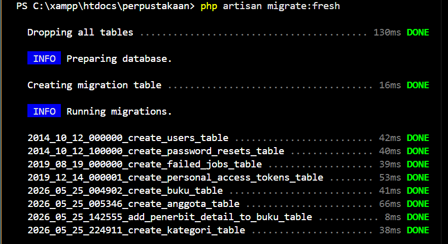
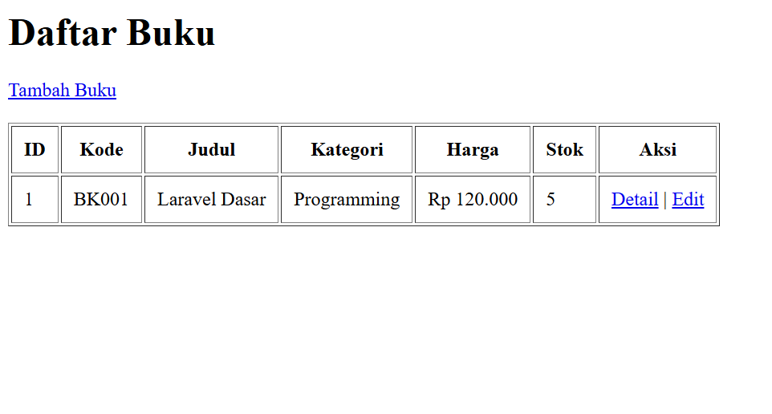
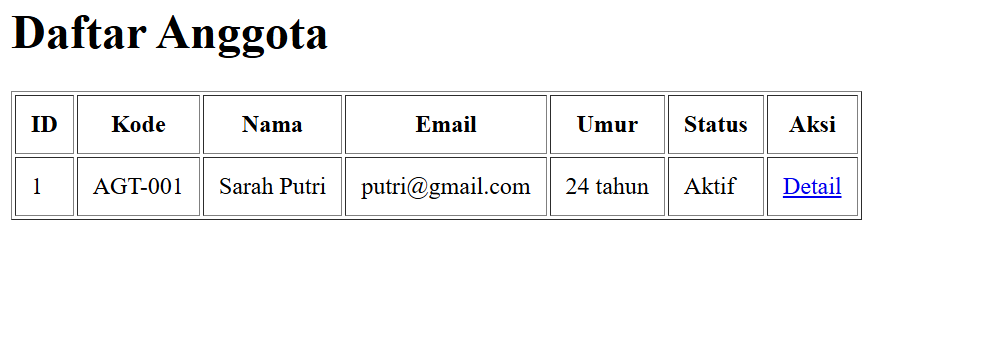
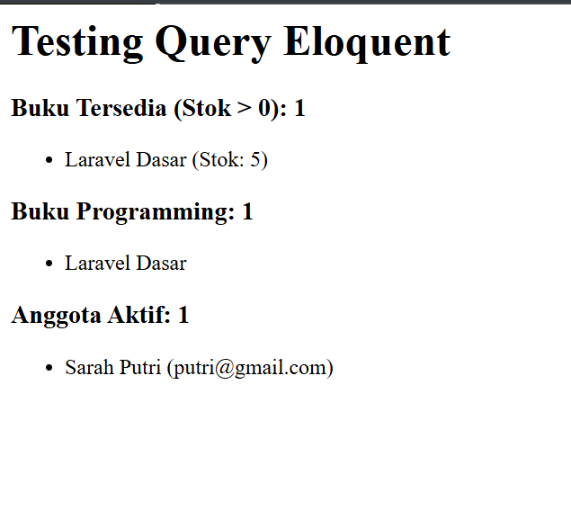
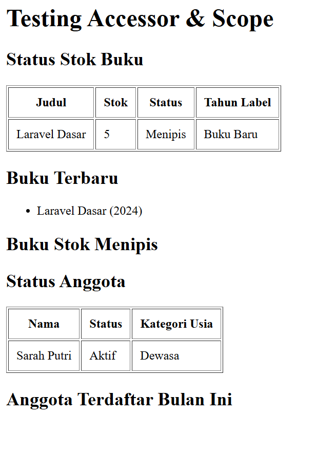

# Sistem Perpustakaan Laravel

## Identitas
- Nama: Aghitsna Yashiiva A. A.
- Mata Kuliah: Pemrograman Web 2
- Tugas: Migration, Seeder, Accessor & Scope

---

# Fitur
- Migration tabel kategori
- Seeder kategori buku
- Accessor Buku
- Accessor Anggota
- Scope Query Buku
- Scope Query Anggota

---

# Screenshot

## Migration


## Daftar Buku


## Daftar Anggota


## Test Query


## Test Accessor Scope


---

# Cara Menjalankan Project

```bash
php artisan migrate
php artisan db:seed --class=KategoriSeeder
php artisan serve
```